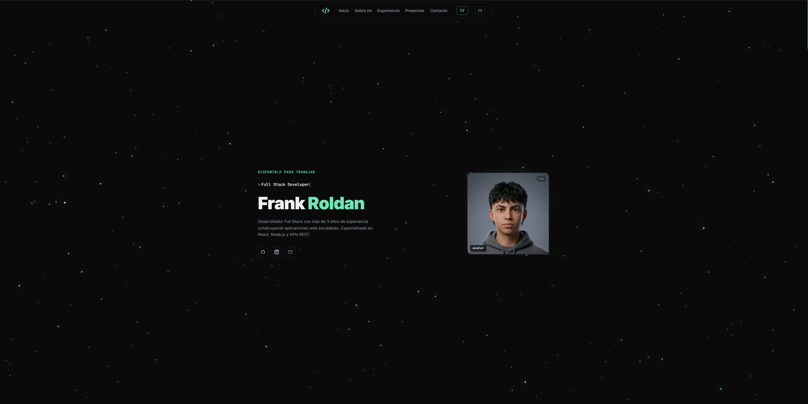

# Alessandro — Portfolio



Portfolio personal de Frank Alessandro Roldán, Full Stack Developer. Sitio de una sola página (`/`) con secciones de inicio, sobre mí, experiencia, proyectos y contacto, ambientado con un fondo de starfield interactivo en canvas y animaciones GSAP orquestadas en el scroll.

> Este repositorio es una vitrina de código, no un template pensado para clonar y correr: el contenido, las imágenes y el CV están personalizados para Alessandro.

## Stack

- [Astro](https://astro.build/) v6
- [Tailwind CSS](https://tailwindcss.com/) v4
- [GSAP](https://gsap.com/) + `useGSAP`/ScrollTrigger — timeline de intro, reveals en scroll y parallax
- Canvas 2D a mano para el starfield (parallax de mouse, constelaciones, meteoros, formación de llaves `{ }` en hover)
- [Web3Forms](https://web3forms.com/) — envío del formulario de contacto
- i18n ES/EN client-side (sin librería, toggle con `localStorage`)

## Estructura

```
src/
├── components/   # Hero, About, Experience, Projects, Contact, Navbar, Footer, Logo
├── layouts/      # Layout.astro — shell, starfield, intro loader, i18n/theme
├── pages/        # index.astro
├── scripts/      # animations.ts — timelines GSAP y ScrollTriggers
├── styles/       # global.css
└── assets/       # fotos, avatar, CV en PDF
```

## Detalles de diseño

- Tema oscuro tipo terminal, acento verde menta (`#6ee7b7`), tipografía JetBrains Mono + Inter.
- Intro loader CSS-first (visible antes de que cargue el JS) que GSAP retira al terminar.
- Starfield global con parallax de cursor, "magnetismo" de estrellas, meteoros ambientales y una formación de llaves `{ }` que se arma con partículas al hacer hover sobre la foto.
- Barra de progreso de scroll y botón "volver arriba".
- Selector de idioma (ES/EN) persistido en `localStorage`, aplicado antes del primer paint para evitar flash de contenido.
